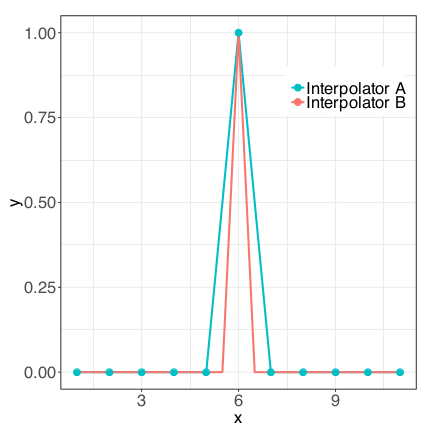

```{r setup, include=FALSE}
knitr::opts_chunk$set(echo = TRUE)
library(MASS)
library(tree)
library(splines)
library(stats)
source('/home/noble_mannu/Documents/PhD/Third/STAT_2270_Data_Mining/HW4/HW4_Fun.R')
```

# Exercise 1

Are regression trees linear smoothers? If they are, provide a proof; if not, explain why not. How about random forests?

Yes, they are linear smoothers. We can write the estimate of a regression tree as follows

\begin{equation}\label{tree}
  \begin{aligned}
    \hat{f}(x') 
      = \sum_{i=1}^{n} W(x_{i},x')y_{i}
      = \sum_{i=1}^{n} \frac{1}{ |R_{m_{i}}| }\Ind\{x'\in R_{m_{i}}\}y_{i}
  \end{aligned}
\end{equation}

Where $R_{m_{i}}$ are the leafs of the tree and $|R_{m_{i}}|=n_{i}$. We assume the tree has $k$ leafs, i.e., $m_{i}\in\{1,\dots,k\}, i\in\{1,\dots,n\}$.

Now, random forest are also linear smoothers. Notice the following

\begin{equation}\label{forest}
  \begin{aligned}
    \hat{g}(x') = \frac{1}{B} \sum_{j=1}^{B} \hat{f}_{j}(x')
      = \frac{1}{B}\sum_{j=1}^{B}\sum_{i=1}^{n} W_{j}(x_{i},x')y_{i}
      = \sum_{i=1}^{n} \left[ \frac{1}{B}
          \sum_{j=1}^{B} W_{j}(x_{i},x')y_{i} \right]
      = \sum_{i=1}^{n} W'_{j}(x_{i},x')y_{i}
  \end{aligned}
\end{equation}

where $\hat{f}_{j}$ are trees similar to as in \eqref{tree} but each split is made according to a random subset of the original features.

# Exercise 2

Show that boosting with stumps (regression trees with only one split) produces a estimate for the regression function that is an additive model.

Let $z=(x,y)$ an observation with $x\in\R^{p},y\in\R$. Consider the following sequence of estimators for boosting.

\begin{equation}
  \hat{f}^{(1)}(x) = c_{1}(x_{1}<t_{1})+c'_{1} 
    = \frac{1}{\lambda}\hat{f}_{1}(x_{1}),
\end{equation}

then $r_{1}=y-\lambda \hat{f}^{(1)}(x)$.

\begin{equation}
  \hat{f}^{(2)}(x) = c_{2}(x_{2}<t_{2})+c'_{2} 
    = \frac{1}{\lambda}\hat{f}_{2}(x_{2}),
\end{equation}

then 

$$r_{2} = r_{1} - \lambda \hat{f}^{(2)}(x)
  = y-\lambda \hat{f}^{(1)}(x) - \lambda \hat{f}^{(2)}(x).$$
  
We do the above until we get $\hat{f}^{(p)}(x)$ and $r_{p}$. Notice then 

\begin{equation}
  r_{p} = y - \lambda \hat{f}^{(1)}(x) - ... - \lambda \hat{f}^{(p)}(x)
    = y - \hat{f}_{1}(x_{1}) - ... - \hat{f}_{p}(x_{p}),
\end{equation}

we can define then 

\begin{equation}
  \hat{f}(x) = \lambda \hat{f}^{(1)}(x) + ... + \lambda \hat{f}^{(p)}(x)
    = \hat{f}_{1}(x_{1}) + ... + \hat{f}_{p}(x_{p})
    = \sum_{i=1}^{p} \hat{f}_{i}(x_{i})
\end{equation}

which is an additive model.

# Exercise 3

Read the paper ``Explaining the Success of AdaBoost and Random Forests as Interpolating Classifiers'' by Wyner et al. that was discussed in class. (You can find that paper here: [http://www.jmlr.org/papers/volume18/15-240/15-240.pdf](http://www.jmlr.org/papers/volume18/15-240/15-240.pdf)).

## Part (a)

Figure 5 in Section 3.3 was one figure shown in class demonstrating the performance of different classifiers on what the authors call the ``pure noise'' model. Write down this model formally to make clear why the authors describe it this way. Provide some explanation.

Their model is 

\begin{equation}
  \prob(x) = \prob (y = 1| x) = p
\end{equation}

which takes a constant value . The authors refer to this model as _pure noise_ because according to them it has no signal, though they mention this model can be a subspace of a more complex model in which $\prob(x)$ is approximately constant. In particular, the model they use for their simulations is a uniform latin hypercube which assigns classes (1,0) with probabilities $(p,1-p)$.

## Part (b)

Rewrite the model in (a) so that this model form produces exactly the same data, but now would appear to contain signal. Again, provide a few lines of explanation.

We can rebrand this model and make it appear to have signal in the following way. For a given vector-valued random variable $X$ and a region $A$ such that $\prob(X \in A) = p$ we can rewrite the model as

$$\prob(Y = 1|X) = p = \prob(X \in A)$$

For example, we could be working with a real valued $X \sim F$ and pick $A = \{ x / x \leq q_{F}(p)\}$, with $q_{F}(p)$ the p-th quantile of $F$ to ensure $\prob( X \in A) = p$. This way the model appears to contain signal.

## Part (c)

The authors argue that in this context, the interpolating nature of boosting and
random forests is what is causing them to perform so well. Provide a brief summary of this argument.

The authors think that boosting and random forests do _fine interpolation_, which they argue provide robustness in a noisy setting. Fine interpolation can be understood as interpolating locally, a concept that they illustrate in Figures 1 and 2. To them, interpolating doesn't rule out consistency out of a model.

In their words: ``We will see see graphically that AdaBoost and random forests interpolate more locally around error points in the training data than the one-NN classifier. Consequently, AdaBoost and random forests are less affected by noise points as one-NN and have lower generalization error. We will show that the self-averaging property of AdaBoost and random forests is crucial.'' (Wyner, 2017, p. 14) Here AdaBoost is an implementation of boosting and NN stands for Nearest Neighbors.

## Part (d)

In this particular context, that argument is completely valid. It does not, however, generalize to ``real data'' settings or really explain why these methods work so well across different datasets. Explain.

In a classification problem, such as the one in Wyner's paper, the following conditions need to be met in order to have interpolation:

\begin{enumerate}
  \item Trees are fully grown.
  \item $\textbf{Classification:}$ All observation appear in more than one half of the bootstrap samples.
  \item $\textbf{Regression:}$ In a regression setting, all observations need to appear in all the bootstrap samples to have interpolation.
\end{enumerate}

If these hold, then $\hat{f}(x_{i})=y_{i}, \forall i$. If either one of the above conditions is not met then boosting/random forest won't interpolate the data.

## Part (e)

On a related note to the previous question, the authors are quite harsh in their critique of the classical statistical setup, arguing that in practice, most modern datasets contain and extremely high amount of signal. Explain why this represents a naive view of the standard regression setup where we assume $Y = f (X) + \epsilon$.

The $\textit{pure noise}$ idea is rather complicated to defend in ``real data''. It can be the case where a "real" dataset is noisy and most of the observations are mislabelled. To illustrate this in a regression setting, consider the following example seen in class.

```{r, echo=FALSE, out.width="60%", fig.cap="An interpolator.", fig.align = 'center'}

```

If all observations were labeled correctly except the point $x=6$ then there would not be much of an issue if tree-based methos were interpolating. Nevertheless, suppose now that $x=6$ is the only point correctly labeled. Here any kind of interpolator will perform badly. However, both boosting and random forests don't perform as badly as interpolators under similar settings.

Another scenario is where the response may simply depend on predictors not being measured or non-available to the researcher.

# Exercise 4

Suppose that we have a dataset with many predictors and a binary response; $y \in \{0, 1\}$, for example.

```{r, include=FALSE}
load(file = '/home/noble_mannu/Documents/PhD/Third/STAT_2270_Data_Mining/HW4/ex4.RData')
```

## Part (a)

Explain why you might still prefer to build a regression tree as opposed to a classification tree. What advantage does a regression tree have, even for (eventually) doing classification?

One of main differences between a regression and a classification tree is that while the regression tree returns a continuous response, the other returns a categorical response. One scenario I can think of where we would like to use regression trees instead of classification trees is when the true model has a continuous response, which was truncated in order to transform it into a categorical response. This is the setup I use for part (b) of this question.

## Part (b)

Give an example where a regression tree is used to perform classification and outperforms a traditional classification tree, as measured by misclassification error:

$$\sum_{i=1}^{n}\Ind\{\hat{y}_{i}\not=y_{i}\}$$

That is, find a dataset where this is the case. The data can be real or simulated but should contain at least a few hundred observations on at least a handful of predictors. Are there any properties of the dataset that make it apparent that the regression tree approach might be preferable?

I created the dataset using as features $X_{1}, \dots,X_{20}  \overset{iid}{\sim} N(0,1)$ and creating the response

$$Y = \sum_{i=1}^{20} X_{i} + \epsilon$$

where $\epsilon \sim N(0,0.25^2)$. Dataset consisted of 1000 observations. As stated in part (a) of this problem the response in the true model was continuous, so the regression tree approach might be preferable this time.

```{r}
# Creating the dataset
set.seed(1923)
observations <- 1000
variables <- 20

x <- matrix(ncol=variables, nrow=observations, byrow = FALSE)
nom <- c()
for(i in 1:variables){
  temp <- rnorm(observations, mean = 0, sd = 1)
  x[,i] <- temp
  nom[i] <- paste0('x',i)
}
colnames(x) <- nom
y <- rowSums(x) + rnorm(n = 1000, sd = 0.25)
data <- data.frame(x,y)
```

After creating the dataset I labeled the observed values of $Y$ as two classes using as threshold a quantile of $\sum_{i=1}^{20} X_{i}$. In particular, if the observed $y$ was above the 0.4-quantile of $N(0,20)$ the observation was assigned labeled as 'yes' and labeled as 'no' otherwise.

```{r}
# Creating the class labels
label <- ifelse(data$y > qnorm(0.4, sd = 20), 'yes', 'no')
```

On a single classification and regression trees I found that the regression tree performed better. The model was trained in 700 observations and the remaining 300 were used as the test dataset.

For assigning the labels in the regression tree $\hat{y}$ was computed and then labels were assigned using the same criteria as above.

```{r}
# Regression tree
set.seed(2)
train <- sample(1:1000, size = 700)
data.test <- subset(data[-train,], select = -y)
label.test <- label[-train]
reg.tree <- tree(y~., data = data, subset = train)
reg.tree.pred <- predict(reg.tree, newdata = data.test)
reghat <- ifelse(reg.tree.pred > qnorm(0.4, sd = 20) , 'yes', 'no')
# Computing the missclasification error
(300 - sum( reghat == label.test ))/300
```

The missclasification error rate for the regression tree was 16%. Next, we run the classification tree

```{r}
# Classification tree
data1 <- subset(data, select = -y)
data1$label <- as.factor(label)
data1.test <- subset(data1[-train,], select = -label)
class.tree <- tree(label~., data = data1, subset = train)
class.tree.pred <- predict(class.tree, data1.test, type = 'class')
# table(class.tree.pred,label.test)
(300 - sum(diag(table(class.tree.pred,label.test))))/300
```

This time the misclassification rate was 18.67%. The regression tree misclassified 48 observations while the classification tree mislabeled 56 observations in the test dataset. Since the experiment was only performed with a single tree we'll run several times with different train/test datasets pulled from the original data. The experiment will be ran 1000 times.

```{r, eval=FALSE}
regresion <- c()
clasificador <- c()

set.seed(3)
for (i in 1:1000) {
# Train/Test datasets
  train <- sample(1:1000, size = 700)
  data.test <- subset(data[-train,], select = -y)
  label.test <- label[-train]
# Regression tree
  reg.tree <- tree(y~., data = data, subset = train)
  reg.tree.pred <- predict(reg.tree, newdata = data.test)
  reghat <- ifelse(reg.tree.pred > qnorm(0.4, sd = 20) , 'yes', 'no')
  regresion[i] <- 300 - sum ( reghat == label.test )  
# Classification tree
  data1 <- subset(data, select = -y)
  data1$label <- as.factor(label)
  data1.test <- subset(data1[-train,], select = -label)
  class.tree <- tree(label~., data = data1, subset = train)
  class.tree.pred <- predict(class.tree, data1.test, type = 'class')
  table(class.tree.pred,label.test)
  clasificador[i] <- 300 - sum(diag(table(class.tree.pred,label.test)))
}
```

After running the procedure we can see that the average missclasification rate for the classification tree was 19.74% (59.21 mislabeled items on average), while the average rate for the regression tree was 16.04% (48.12 milabels on average). We conclude that with this setup a regression tree outperforms a classification tree.

```{r}
mean(clasificador)/300
mean(regresion)/300
```

# Exercise 5

In class we discussed the fact that the out-of-bag measures have a tendency to artificially inflate the perceived importance of correlated predictors. Here we’ll walk through a simple example demonstrating this.

```{r, include=FALSE}
load('/home/noble_mannu/Documents/PhD/Third/STAT_2270_Data_Mining/HW4/ex5.RData')
```

## Part (a)

Create a training dataset with 1000 observations on 10 predictors where the response is given by $Y  = \sum_{i=1}^{10}X_{i}+\epsilon$. You can do this however you like, but $X_{3}, \dots, X_{10}$ should be independent of each other as well as $X_1$ and $X_2$, $X_1$ and $X_2$ should be strongly correlated (let’s say around 0.9), and $\epsilon$ should have mean 0 and relatively small variance. Generate an additional (independent) test dataset with 100 observations.

Here we create the training dataset. Variables $X_{1}$ and $X_2$ were set to have correlation equal to 0.9. The remaining features were created as iid variables. Variables are distributed as $X_{i}\sim N(0,1), i\in\{1,\dots,10\}$. Model was constructed as

$$Y = \sum_{i=1}^{10}X_{i}+\epsilon$$
where $\epsilon\sim N(0,0.25^2)$.

```{r, eval=FALSE}
# Creating the training dataset
group1 <- simulate.normal(n = 1000, features = 2, mu = rep(0, times = 2), 
                          sample.corr = 0.9, 
                          empirical = TRUE)
group2 <- mvrnorm(n=1000, mu = rep(0, times = 8), Sigma = diag(8))
data5 <- data.frame(group1,group2)
nom <- c()
for(i in 1:10){
  nom[i] <- paste0('x',i)
}
names(data5) <- nom

y <- rowSums(data5)+rnorm(1000, mean = 0, sd = 0.25)
data5$y <- y
```

```{r, eval=FALSE}
# Create the test dataset
group1 <- simulate.normal(n = 100, features = 2, mu = rep(0, times = 2),
                          sample.corr = 0.9, empirical = TRUE)
group2 <- mvrnorm(n=100, mu = rep(0, times = 8), Sigma = diag(8))
test5 <- data.frame(group1,group2)
nom <- c()
for(i in 1:10){
  nom[i] <- paste0('x',i)
}
names(test5) <- nom

y <- rowSums(test5)+rnorm(100, mean = 0, sd = 0.25)
test5$y <- y
```

## Part (b)

Using the __randomForest function__ in __R__, build a random forest with the training data and be sure to set __importance = TRUE__. Look at the random forest importance measures and plot the __%IncMSE__ scores for each predictor. You should see that $X_1$ and $X_2$ appear more important than the others.

Here we run random forest.

```{r, eval=FALSE}
forest <- randomForest(y~., data = data5, ntree=500, importance = TRUE)
yhat.for <- predict(forest, newdata = subset(test5, select = -y))
```

Here we plot the __%IncMSE__ scores for each feature as given by the randomForest() function.

```{r, echo=FALSE}
temp <- forest$importance
plot(temp[,1], xlab = 'X_i', ylab = '%IncMSE')
title('Importance of features (%IncMSE)')
```

From the plot we can see that $X_1$ and $X_2$ appear to be more important than the other covariates. The test error for the original dataset was $MSE=2.475062$

```{r, eval=FALSE}
MSE <- mean( (yhat.for - test5$y)^2 )
```

## Part (c)

Now let’s measure the importance differently. Construct a total of 10 additional random forests. For the $i^{th}$ forest, randomly permute the values of the $i^{th}$ predictor variable before constructing it and record the difference in MSEs on the test set:

$$MSEperm_{i}=MSE_{-i}-MSE$$

where $MSE_{−i}$ is the MSE from the random forest with the $i^{th}$ predictor permuted, and $MSE$ denotes the MSE from the forest built with the original data and evaluated on the test set. Compare these importance measures to those from part (b).

Let's compute the new measures, $MSEperm_{i}, i\in \{1,\dots,10\}$.

```{r, eval=FALSE}
errors <- c()
for (i in 1:10) {
  temp <- shuffle.features(data = data5, columns = i)
  forest <- randomForest(y~., data = temp, ntree = 500, importance = FALSE)
  yhat.for <- predict(forest, newdata = subset(test5, select = -y))
  errors[i] <- mean( (yhat.for - test5$y)^2 )  
}
msei <- errors-MSE
```


```{r, echo=FALSE}
plot(msei, xlab = 'X_i', ylab = 'MSEperm_i')
title('Importance of features (MSEperm_i)')
```

First notice that if $MSEperm_{i}$ is large, then the $i^{th}$ variable is important. When the $i^{th}$ variable was permuted the error increased. Notice this time that using the $MSEperm$ metric, this time $X_1$ and $X_2$ appear to be less important than the rest of the covariates.

The above makes sense because when we deleted say $X_1$, $X_2$ remained and since they are hihgly correlated, most of the information in $X_1$ is present in $X_2$ so the deletion doesn't have a great impact on the error.

## Part (d)

Repeat part (c) but instead of permuting the $i^{th}$ predictor on the $i^{th}$ iteration, simply remove it from the data frame. Compare these new importance measures to the two calculated previously. Would you prefer the importance measures calculated here, or those calculated in part (c)? Why?

Here we'll modify the metric a little

$$MSEdel_{i}=MSE_{-i}-MSE$$

where $MSE_{−i}$ is the MSE from the random forest with the $i^{th}$ predictor deleted, $MSE$ denotes the MSE from the forest built with the original data and evaluated on the test set.

Let's compute the new measures, $MSEdel_{i}, i\in \{1,\dots,10\}$.

```{r, eval=FALSE}
errors1 <- c()
for (i in 1:10) {
  temp <- data5[,-i]
  forest <- randomForest(y~., data = temp, ntree = 500, importance = FALSE)
  temp.test <- test5[,-i]
  yhat.for <- predict(forest, newdata = subset(temp.test, select = -y))
  errors1[i] <- mean( (yhat.for - test5$y)^2 )
}
msei1 <- errors1 - MSE
```

```{r, echo=FALSE}
plot(msei1, xlab = 'X_i', ylab = 'MSEdel_i')
title('Importance of features (MSEdel_i)')
```

The new measures $MSEdel_{i}$ behave in a similar way than $MSEperm_{i}$. When $MSEdel_{i}$ is large, the $i^{th}$ variable is important. Once again features $X_1$ and $X_2$ appear to be less important than the rest of the covariates. In addition, variables $X_3,\dots,X_8$ seem to be less important than $X_9$ and $X_{10}$.

If needed, I would select the importance measures $MSEperm_{i}$ because in $MSEdel_{i}$ we lose some information while deleting the covariates before running the random forest procedure.

# Exercise 6

_Demonstrating Double Descent:_ Daniella Witten recently gave an excellent demonstration, [https://twitter.com/daniela_witten/status/1292293102103748609](https://twitter.com/daniela_witten/status/1292293102103748609), of the double descent phenomenon using regression splines (see the link). These models produce a spline fit via ordinary least squares on a transformed feature space. You can get more information about regression splines in the ISLR textbook. Repeat her analysis here. In particular, produce the "double-descent" curve in this context and see what happens when we use something like a ridge loss instead.

```{r, include=FALSE}
load('/home/noble_mannu/Documents/PhD/Third/STAT_2270_Data_Mining/HW4/ex6.RData')
```

The true model we're going to use is the same as in the Twitter thread

$$Y = cos(X) + \epsilon$$

where $\epsilon \sim N(0,0.3^2)$. Our training set is going to have 20 observations and our test set is going to have 5 independent observations. Next we create the training dataset.

```{r}
# Creating the training set
set.seed(1500)
x <- seq(from = -4.5, to =4.5, by= 0.46)
e <- rnorm(n = 20, mean = 0, sd = 0.3)
y <- cos(x) + e
data <- data.frame(x,y)

xlims <- range(x)
x.grid <- seq(from = xlims[1], to = xlims[2], by = 0.1)

xlims <- range(x)
x.grid <- seq(from = xlims[1], to = xlims[2], by = 0.1)
```

## Natural cubic splines with df <= 20

Now we fit a spline with 4 degrees of freedom, and se how it looks against the true model.

```{r}
fit <- lm(y ~ ns(x, df = 4)-1, data = data )
pred <- predict(fit, newdata = list(x = x.grid), se = TRUE)
```

```{r, echo=FALSE}
plot(x, y, ylim = c(-2,2))
lines(x.grid, cos(x.grid), lwd = 2) # True model
lines(x.grid, pred$fit, lwd = 2, col = 'blue') # Predicted function
legend('topright', legend = c('4/DF Spline', 'True model'),
       col = c('blue', 'black'), lty = 1, lwd = 2, cex = 0.8)
title('Natural cubic spline with 4 DF')
```

This prediction doesn't look bad, let's see how the spline with 6 degrees of freedom looks like

```{r}
fit2 <- lm(y ~ ns(x, df = 6)-1, data = data )
pred2 <- predict(fit2, newdata = list(x = x.grid), se = TRUE)
```

This one looks a little bit better and closer to the true model.

```{r, echo=FALSE}
plot(x, y, ylim = c(-2,2))
lines(x.grid, cos(x.grid)) # True model
lines(x.grid, pred2$fit, lwd = 2, col = 'blue') # Predicted function
legend('topright', legend = c('6/DF Spline', 'True model'),
       col = c('blue', 'black'), lty = 1, lwd = 2, cex = 0.8)
title('Natural cubic spline with 6 DF')
```

And now all the way to 20 degrees of freedom.

```{r}
fit3 <- lm(y ~ bs(x, df = 20)-1, data = data )
pred3 <- predict(fit3, newdata = list(x = x.grid), se = TRUE)
```

This time we can see that our estimated function is overfitting and doesn't look right while plotted against the true model.

```{r, echo=FALSE}
plot(x, y, ylim = c(-2,2))
lines(x.grid, cos(x.grid)) # True model
lines(x.grid, pred3$fit, lwd = 2, col = 'blue') # Predicted function
legend('topright', legend = c('20/DF Spline', 'True model'),
       col = c('blue', 'black'), lty = 1, lwd = 2, cex = 0.8)
title('Natural cubic spline with 20 DF')
```

## Natural cubic splines with df > 20

Ok, so this is the scary part, we'll use more than 20 degrees of freedom. Let's do it for df = 21, 24 and 36 and see how the estimated functions look like. As in Witten's thread, I'm using Singular Value Decomposition (SVD) and the pseudo-invserse to compute the _minimum_-norm fit estimates.

$\textbf{NOTE:}$ For a matrix $A \in \mathbb{R}^{n \times p}$, the SVD has the form 

$$A=U \Sigma V^{T}$$

where $U \in \mathbb{R}^{n \times n}, \, V \in \mathbb{R}^{p \times p}$ are unitary matrices ($U^{T}U = UU^{T}=I_{n}$ and similarly for $V$). If $A$ is not full rank then we use the SVD and pseudo-inverse to get the solution to the problem

$$Ax=y$$

The minimum-norm solution for $x$ will have the form

$$x_{ln} = V \Sigma^{\dagger} U^{T} y$$

where $\Sigma^{\dagger}$ is the pseudo-inverse of $\Sigma$. We use this in order to get the coefficient estimates for the splines with $df \geq 21$.

```{r, include=FALSE}
X <- bs(x,df =21)[,1:21]
s <- svd(X)
D <- diag(s$d)
Dinv <- ginv(D)
U <- s$u
V <- s$v
beta <- s$v %*% Dinv %*% t(s$u) %*% y

X.new <- bs(x.grid, df = 21)[,1:21]
pred.new <- X.new %*% beta
```

```{r, echo=FALSE}
plot(x, y, ylim = c(-2,2))
lines(x.grid, cos(x.grid)) # True model
lines(x.grid, pred.new[,1], lwd = 2, col = 'blue') # Predicted function
legend('topright', legend = c('21/DF Spline', 'True model'),
       col = c('blue', 'black'), lty = 1, lwd = 2, cex = 0.8)
title('Natural cubic spline with 21 DF')
```

```{r, include=FALSE}
X <- bs(x,df =24)[,1:24]
s <- svd(X)
D <- diag(s$d)
Dinv <- ginv(D)
U <- s$u
V <- s$v
beta <- s$v %*% Dinv %*% t(s$u) %*% y

X.new <- bs(x.grid, df = 24)[,1:24]
pred.new <- X.new %*% beta
```

```{r, echo=FALSE}
plot(x, y, ylim = c(-2,2))
lines(x.grid, cos(x.grid)) # True model
lines(x.grid, pred.new[,1], lwd = 2, col = 'blue') # Predicted function
legend('topright', legend = c('24/DF Spline', 'True model'),
       col = c('blue', 'black'), lty = 1, lwd = 2, cex = 0.8)
title('Natural cubic spline with 24 DF')
```

```{r, include=FALSE}
X <- bs(x,df =36)[,1:36]
s <- svd(X)
D <- diag(s$d)
Dinv <- ginv(D)
U <- s$u
V <- s$v
beta <- s$v %*% Dinv %*% t(s$u) %*% y

X.new <- bs(x.grid, df = 36)[,1:36]
pred.new <- X.new %*% beta
```

```{r, echo=FALSE}
plot(x, y, ylim = c(-2,2))
lines(x.grid, cos(x.grid)) # True model
lines(x.grid, pred.new[,1], lwd = 2, col = 'blue') # Predicted function
legend('topright', legend = c('36/DF Spline', 'True model'),
       col = c('blue', 'black'), lty = 1, lwd = 2, cex = 0.8)
title('Natural cubic spline with 36 DF')
```

Similarly to Witten's results, the splines with 24 and 36 degrees of freedom look a little bit nicer than the spline with 20 df. What remains is to check the _double descent_ behaviour of the test error.

## Double descent

For computing the test error I create a test dataset with 5 samples, where the feature $X$ was sampled from a uniform distribution $U(-4.5,4.5)$. After sampling $x$, the response was constructed as in the training dataset. I computed the test error and repeated this 5 times to smooth a little the test error curve.

```{r, include=FALSE}

set.seed(1501)
mse <- c()
empty_list <- vector(mode = "list", length = 19)
for (j in 1:5) {
  x.test <- runif(min = -4.5, max = 4.5, n = 5)
  e.test <- rnorm(n = 5, mean = 0, sd = 0.3)
  y.test <- cos(x.test) + e.test
  test <- data.frame(x.test,y.test)
  names(test) <- c('x','y')
  for (i in 1:19){
    mod <- lm(y ~ ns(x, df = i)-1, data = data )
    yhat <- predict(mod, newdata = list(x = test$x), se = TRUE)
    error <- mean( ( yhat$fit - test$y  )^2 )
    mse[i] <- error
  }
  empty_list[[j]] <- mse
}

errors <- do.call(rbind, empty_list)
errors <- colMeans(errors)
```

```{r, include=FALSE}
mse1 <- c()
empty_list1 <- vector(mode = "list", length = 81)
for (j in 1:5) {
  x.test <- runif(min = -4.5, max = 4.5, n = 5)
  e.test <- rnorm(n = 5, mean = 0, sd = 0.3)
  y.test <- cos(x.test) + e.test
  test <- data.frame(x.test,y.test)
  names(test) <- c('x','y')
  for (i in 20:100) {
  X <- bs(x,df =i)[,1:i]
  s <- svd(X)
  D <- diag(s$d)
  Dinv <- ginv(D)
  U <- s$u
  V <- s$v
  beta <- s$v %*% Dinv %*% t(s$u) %*% y
  
  X.new <- bs(x.grid, df = i)[,1:i]
  pred.new <- X.new %*% beta
  temp <- mean( (pred.new[,1] -  test$y )^2 )
  mse1[i-19] <- temp
  } 
  empty_list1[[j]] <- mse1
}

errors1 <- do.call(rbind, empty_list1)
errors1 <- colMeans(errors1)

```

```{r}
plot(1:100, c(errors,errors1), type = 'l', lwd = 2, xlab = 'DF', ylab = 'MSE')
legend('topright', legend = c('Test error'),
       col = c('black'), lty = 1, lwd = 2, cex = 0.8)
title('Test error VS Degrees of freedom')
```

We can appreciate the _double descent_ behaviour right after DF = 20. 

### Smoothing splines

When we use ridge loss, i.e. using _smoothing splines_ we get a different result.

```{r}
errors2 <- c()
for (i in 2:20) {
  smoth <- smooth.spline(x,y, df = i)
  #y.s <- predict(smoth, newdata = list(x = test$x), se = TRUE)
  y.s <- predict(smoth$fit, x = test$x)
  mse.s <- mean( ( y.s$y - test$y )^2 )  
  errors2[i-1] <- mse.s
}
```

```{r}
plot(2:20, errors2, type = 'l', lwd = 2, xlab = 'DF', ylab = 'MSE')
legend('topright', legend = c('Test error'),
       col = c('black'), lty = 1, lwd = 2, cex = 0.8)
title('Test error VS Degrees of freedom')
```

As predicted, the test error for the smoothing splines was lower than regular natural cubic splines. This concludes our analysis and the HW. :)